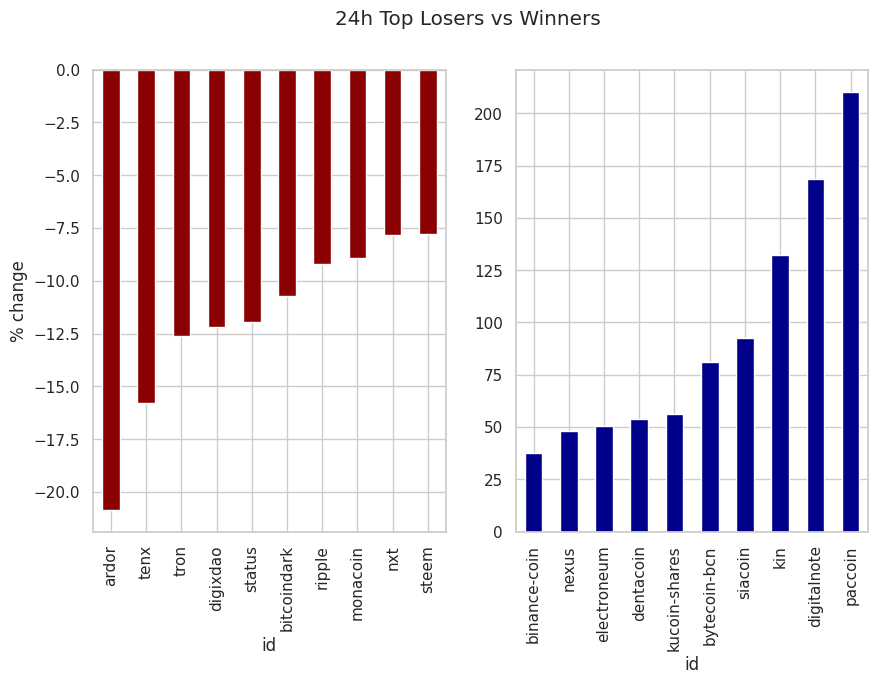
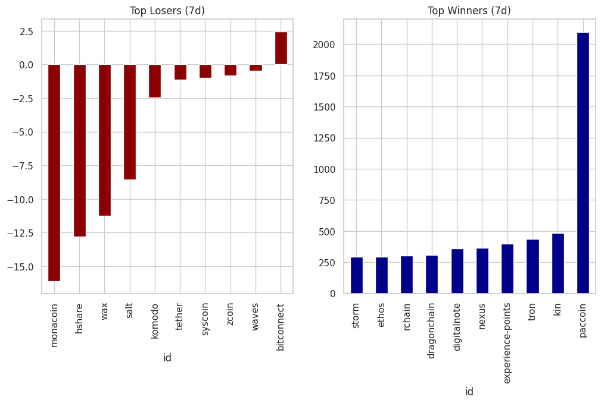

# 📊 Classifying Cryptocurrencies by Market Capitalization

## 🔗 Live Dashboard
[Access the live interactive analysis here](https://classifying-cryptocurrencies-by-market-capitalization-bjyn9rn4.streamlit.app/)

---

## 📈 Key Visualizations

### 1️⃣ Top 10 Market Capitalization

*Dominance of top 10 assets as a percentage of total market cap.*

### 2️⃣ 24-Hour Price Volatility

*The biggest gainers and losers in a single day cycle.*

### 3️⃣ Weekly Performance Analysis

*Market trends observed over a 7-day window.*

### 4️⃣ Market Cap Classification

*Segmenting assets into Biggish, Micro, and Nano tiers.*

---

## 👩‍💻 Author
**M. Divya Lalitha**
* **GitHub**: [M-Divya29](https://github.com/M-Divya29)
