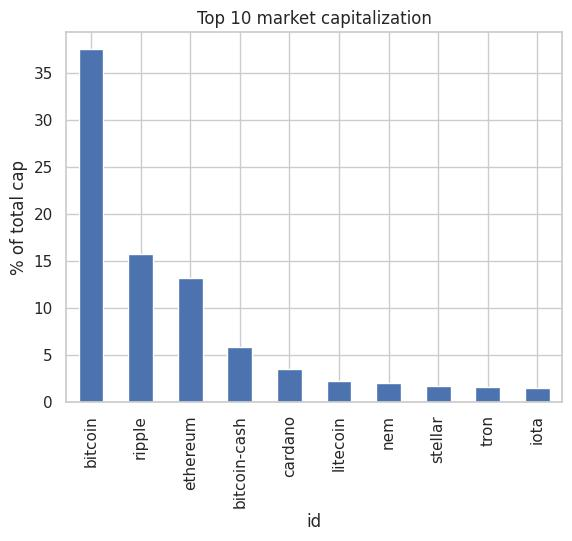

# 📊 Classifying Cryptocurrencies by Market Capitalization

## 📌 Overview

This project analyzes cryptocurrency market data and categorizes cryptocurrencies based on their market capitalization.  
It includes performance analysis using 24-hour and 7-day percentage changes and generates clear visual representations of market trends.

The implementation is done using Python in Jupyter Notebook / Google Colab.

---

## 🎯 Objectives

- Analyze cryptocurrency market capitalization
- Identify Top 10 cryptocurrencies by market value
- Evaluate 24-hour and 7-day price changes
- Classify cryptocurrencies into market cap segments
- Visualize insights using charts

---

## 🛠 Technology Stack

- **Python 3**
- **Pandas** – Data manipulation and analysis
- **NumPy** – Numerical operations
- **Matplotlib** – Data visualization
- **Jupyter Notebook / Google Colab**

---

## 📂 Project Structure

.
├── Classifying_Cryptocurrencies_by_Market_Capitalization.ipynb
├── coinmarketcap_06012018.csv
├── requirements.txt
├── README.md
└── images/
├── fig1_marketcap.jpeg
├── fig2_24h.png
├── fig3_weekly.png
└── fig4_classification.png

---

## 📊 Key Visualizations

### 1️⃣ Top 10 Cryptocurrencies by Market Capitalization

### 2️⃣ 24-Hour Top Gainers and Losers

### 3️⃣ Weekly Performance Analysis

### 4️⃣ Market Capitalization Classification

---

## ▶️ Setup & Execution

### Step 1: Clone the Repository

git clone https://github.com/M-Divya29/Classifying-Cryptocurrencies-by-Market-Capitalization.git

### Step 2: Install Dependencies

### Step 3: Run the Notebook
Open the `.ipynb` file in:
- Jupyter Notebook, or  
- Google Colab  

Run all cells to reproduce the analysis.

---

## 📌 Conclusion

This project demonstrates structured data analysis, categorization logic, and visualization techniques using Python. It provides a clear overview of cryptocurrency market behavior based on capitalization and short-term price movements.

---

## 👩‍💻 Author

**M. Divya Lalitha**  
GitHub: https://github.com/M-Divya29

